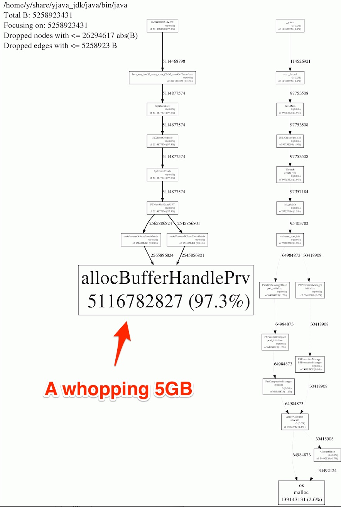
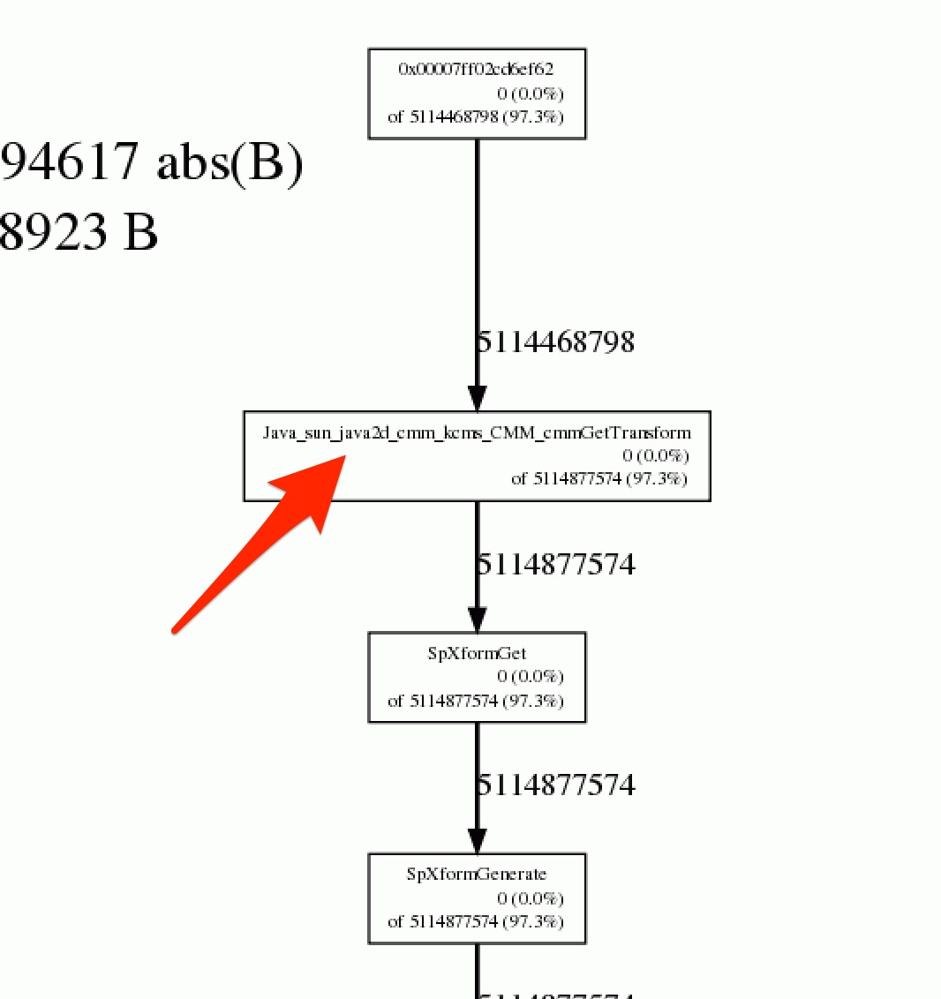
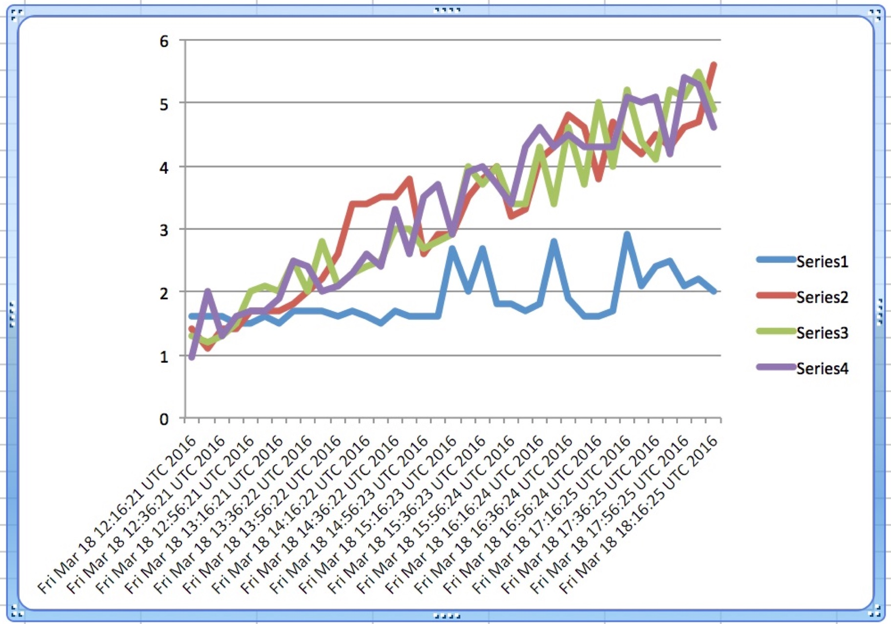

# native-jvm-leaks

Anatomy of a memory leak - debugging native memory leaks in the JVM
===================================================================

So you're certain you have no memory leaks in your Java application yet your process defies all limits you've set for it, max heap, max stack size, even max direct memory. It grows and grows until you run the machine out of memory. Unfortunately there are a lot of cases in Java where native memory allocation is invisible to the JVM, whether it's inside JNI code or memory allocated directly from the core native Java implementation . This can leave you scratching your head and guessing at where you may have opened some resource and failed to close it. I spent a week debugging my current problem until I discovered jemalloc which I'll discuss in a minute.

What exactly IS an off-heap leak?
---------------------------------
For the purposes of this discussion, I'll define it as a growth in resident memory size of your JVM over time, as seen by the RSS column in "ps -aux" or as RES in the top command. Don't panic over the virtual memory size. There are many things happening in a 64-bit system that can make this size appear huge. The kernel can allocate memory into various "arenas" to reduce contention in a highly threaded environment. This is likely nothing to be concerned about if your resident size is low. The memory is not necessarily in use.

Is your leak really native?
---------------------------
Probably not. Make sure you rule out heap leaks first. It's the low-hanging fruit and there are many good resources for doing this with profilers such as "mat" for Eclipse, Yourkit, etc. You can even find obvious leaks with nothing more than "jmap -histo:live pid" and watch the post-GC heap-size over time. If it's leaking, then compare the object instances to see which class is growing. Profilers like Yourkit are a little more difficult to wire into your jvm startup but do all the work for you by letting you snapshot object counts, analyzing the delta over time, etc.

Is your application allocating off-heap memory?
-----------------------------------------------
We aren't yet at the point of diving into native off-heap memory allocations. It may still be possible to find your leak from the JVM heap. Within your profiler, you may see the numbers for off-heap allocation, aka direct memory. This tracks the amount of memory allocated by your application in the form of DirectByteBuffers which hold a reference to off-heap memory. If your heap is low but your off-heap/direct memory is high, then you may be leaking away these byte buffers. Capture a heap dump with jmap and analyze it with your preferred profiler and see which on-heap objects are referencing the DirectByteBuffers and determine whether they are leaking. Also watch for MemoryObject instances which work similarly. Again, this is not the point of this post.

I knew that already! I'm still screwed!
---------------------------------------
So your heap looks good, you can't find any off-heap references, the JVM claims off-heap allocations are reasonable, and yet your resident size continues to grow. If your leak is very slow, you may want to search for discussions on how malloc arenas affect the JVM. I have seen reports that this can cause resident leaks in the JVM over time, though I have not seen this myself. Normally the malloc arenas allocate VIRTUAL space where memory can be allocated from various threads to reduce contention. There is an environment variable MALLOC_ARENA_MAX that defaults to 8 which means there may be up to 8 x number-of-cores separate arenas allocating in 64MB chunks. Our machines have 40 cores so you do the math.

That said, it's probably more likely you have a real leak in native code. Much of the java code itself is native and so, if misused (and sometimes even if not), may not be visible at all to the JVM. This is the problem we are trying to solve here.

Going native with jemalloc
--------------------------
jemalloc is an alternative to the standard malloc in the C library. This alternate implementation was created with the focus of high performance in a highly threaded environment such as ours as well as an attempt to improve on memory fragmentation. Groups at Facebook and Twitter have blogged about its use operationally. But its performance is not my reason for discussing it here. It just happens to come with some great profiling capabilities that can help us track down where all our memory is being consumed, so let's stop the chit-chat and get down to business!

Building
--------
The jemalloc library needs to be built from source to enable profiling so download the source from this location and put it directly onto the machine you are troubleshooting:

Get it here: [Jemalloc on github](https://github.com/jemalloc/jemalloc/releases).

I took the file jemalloc-4.1.0.tar.bz2 for my testing. Be careful not to collide with existing jemalloc installations on your machine. Other software such as Cassandra may have already seen the light and installed it on the machine so be careful not to clobber what's there. Build the library like this:
```
./configure --enable-prof
make
sudo make install
```
The install step will write the .so files and utilities such as jeprof to /usr/local/... See the caveat above about not clobbering some existing installation. After this step, you will have jemalloc library as well as its profiling utility installed here:
```
/usr/local/lib/libjemalloc.so
/usr/local/bin/jeprof
```
Starting your JVM with jemalloc
-------------------------------
Normally one would link directly with the jemalloc.so file when compiling, but we don't have that luxury since we are running the jvm. Luckily, there is a trick for making the .so get loaded automatically when the process starts. To do this, modify your start script to set this environment variable:
```
export LD_PRELOAD=/usr/local/lib/libjemalloc.so
```
This results in your executable automatically loading the shared library up front before anything else gets resolved. If you do pmap on your running executable after it is up, you'll see libjemalloc.so is loaded at the very top of memory. As a result, when the jvm gets loaded any references to malloc are already resolved to our profiling-enabled .so.

Configuring the profiler
------------------------
We're not ready to fire it up yet! First we need to define what kind of output jemalloc will output in terms of profiling. Here is a sample of what I have used. Again, in a native application one can modify these settings via global variables in the library, however we are able to set them via an environment variable instead:
```
export MALLOC_CONF=prof:true,lg_prof_interval:31,lg_prof_sample:17,prof_prefix:/my/output/directory/jeprof
```
Some explanation of the numbers here. The 31 in this case is the log base 2 of the interval in bytes between allocations that we want jemalloc to report. Whaaaa?! That's right, log base 2, as though profiling native memory allocation weren't already difficult enough without requiring us to do math. In this case 2^31 is about 2GB, so every 2GB of memory allocation, we'll get a .heap output file specified in the prof_prefix location. Make sure /my/output/directory exists and is writable by your process and you'll get a lot of files named /my/output/directory/jeprof*.heap These are the haystacks that jeprof will dig through to find our needle.

Let 'er rip!
------------
Restart your JVM and confirm from your logging that you haven't destroyed your production node. Don't leave your users wondering what just happened to their cat video! If your logs are spewing nonsense like Donald Trump at a klan rally, just back out the environment variables and restart. In my own experience, though, I have seen no errors and no obvious slowdown even under heavy load in production. Observe /my/output/directory for a while to see if your .heap files start showing up. To test out your config, you could lower the lg_prof_interval just to confirm your setup before changing it to some reasonable number. In my setup, the .heap files were roughly 90K each so you'll want to monitor the disk usage there if you're going to be running for a long period of time.

Finding the needle
------------------
At any point, you can ask jeprof to analyze one of the .heap files to see what is presently holding all the memory. Expect it to change over time to highlight the heavy allocators. It naturally prunes out the noise of small allocations and leaves you with the highlights. Here's how you do that. You'll need to specify the path to your java executable which jeprof will use to determine the symbols:
```
jeprof --show_bytes --gif \
/home/y/share/yjava_jdk/java/bin/java \
/my/output/directory/jeprof-blah-blah.heap > output.gif
```
Copy that gif back to some machine where you can view it. With any luck, the heavens will open, the sun will shine, and a little tear will form at the corner of your eye as you finally glimpse the place where those gigabytes are being stashed away. It may not be the EXACT location of the leak since this is native code. Don't expect a neat Java stacktrace, those are hidden inside the Java runtime except for where Java calls into native code. With any luck, the naming in the native code will give you a clue as to which Java class is calling it (either your own or some third party). In my case for example, I can see that the function was named: Java_sun_java2d_cmm_kcms_CMM_cmmGetTransform which clued me in to the Java2D graphics library we use. Here was my output:



And here we are zoomed in at the top of that branch:



As I said the kcms packaged clued me in as to where the problem might be, but can we tell exactly who is calling that cmmGetTransform method? There may be better ways, but it was suggested (see GDS below) to find the call with a stack trace, so I gave that a try. There is no guarantee you will catch it in one try so I did a little scripting to take continuous stack traces of my JVM and grepping for "cmmGetTransform".
```
#!/bin/bash

PID=19467
SEARCH_FOR=cmmGetTransform

for i in {1..10}; do
   echo "Iteration ${i}"
   jstack ${PID} | tee stack-${i}.txt | grep "${SEARCH_FOR}"
done
```
I ran with 10 iterations and got one hit. Mileage may vary depending on your call frequency of course so you may have to run it many iterations and perhaps you'll even have multiple leaky calls to the same native entry point. Here was my output
```
sh-4.1$ ./find-native.sh
Iteration 1
Iteration 2
Iteration 3
Iteration 4
	at sun.java2d.cmm.kcms.CMM.cmmGetTransform(Native Method)
Iteration 5
...
Iteration 10
```
Here was the Java stack I found that made the transition from Java land, into native code where the memory was collecting:
```
"Thread-539618" #539764 daemon prio=5 os_prio=0 tid=0x00007f6585b31000 nid=0x92fd runnable [0x00007f6b6f9f7000]
   java.lang.Thread.State: RUNNABLE
        at sun.java2d.cmm.kcms.CMM.cmmGetTransform(Native Method)
        at sun.java2d.cmm.kcms.CMM.createTransform(CMM.java:146)
        at java.awt.image.ColorConvertOp.filter(ColorConvertOp.java:540)
        at com.sun.imageio.plugins.jpeg.JPEGImageReader.acceptPixels(JPEGImageReader.java:1268)
        at com.sun.imageio.plugins.jpeg.JPEGImageReader.readImage(Native Method)
        at com.sun.imageio.plugins.jpeg.JPEGImageReader.readInternal(JPEGImageReader.java:1236)
        at com.sun.imageio.plugins.jpeg.JPEGImageReader.read(JPEGImageReader.java:1039)
        at javax.imageio.ImageIO.read(ImageIO.java:1448)
        at javax.imageio.ImageIO.read(ImageIO.java:1352)
        ....my application code...
```

In my case, I fixed a single node in a small four-node cluster then plotted the effect over time. It looks like there may still be a leak there but jemalloc clearly went straight to the heart of the problem.



References
----------
I got my inspiration from the two blogs below and tried to build on what they have done. I hope you'll check them out! Follow me  [here](https://twitter.com/jefferygriffith) on Twitter.


[Technology at GDS](https://gdstechnology.blog.gov.uk/2015/12/11/using-jemalloc-to-get-to-the-bottom-of-a-memory-leak/),
[Evan Jones](http://www.evanjones.ca/java-native-leak-bug.html)

